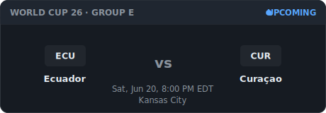
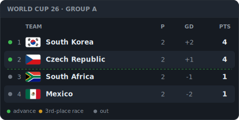
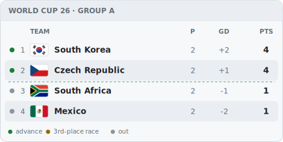
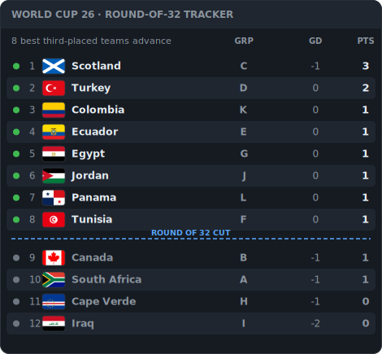

# ⚽ World Cup 2026 README Widget

**Self-updating FIFA World Cup 2026 panels you can drop into any GitHub README, website, or wiki — with one line of Markdown.** Live match, group standings, and the only **Round-of-32 qualification tracker** that handles the new 48-team format. No API key, no account, no JavaScript — just ``-able SVG.

<p align="center">
  
</p>

> Built on the free, public-domain [openfootball](https://github.com/openfootball/worldcup.json) dataset. Kickoff times convert to **your** timezone. Light and dark themes included.

---

## Add it to your README

Paste a line, swap in your deployment URL, done. (Deploy your own in ~2 minutes — see [Deploy](#deploy) — or use the demo instance.)

```markdown
<!-- Live / next match, in your timezone -->


<!-- A group's standings -->


<!-- Round-of-32 qualification tracker -->

```

## Panels

### `/match` — live / next / latest
Shows the in-progress match, or the next kickoff in your timezone, or the most recent result — whichever is relevant right now.


### `/group?id=A…L` — standings with the qualification cut
Full table (P · GD · Pts) with color-coded status and a dashed line marking the top-two cut.

 

### `/r32` — Round-of-32 qualification tracker ⭐
The 2026 World Cup is the first with **12 groups**, where the top 2 of each group **plus the 8 best third-placed teams** advance to a new Round of 32. Ranking those third-placed teams against each other is genuinely confusing — and no other README tool does it. This panel ranks all 12 and draws the line where the cut falls.



> _Gallery images use simulated mid-tournament results so you can see the panels populated. Live panels show fixtures until matches are played, then fill in automatically._

## Parameters

| Param | Panels | Values | Default |
|-------|--------|--------|---------|
| `tz`  | `/match` | Any [IANA timezone](https://en.wikipedia.org/wiki/List_of_tz_database_time_zones) (e.g. `Europe/London`, `Asia/Tokyo`) | `UTC` |
| `theme` | all | `dark`, `light` | `dark` |
| `id` | `/group` | Group letter `A`–`L` | `A` |

## How it works

- **Data:** the public-domain [openfootball/worldcup.json](https://github.com/openfootball/worldcup.json) feed — no API key, no rate limits. Results land after each match; a `~5 min` server cache plus HTTP `s-maxage` keeps it fresh without hammering the source.
- **Rendering:** each endpoint is a tiny Vercel serverless function that returns an SVG string. Zero client JS; renders identically in a README, a webpage, or an `` tag.
- **"Near-live", not real-time:** GitHub proxies README images through its camo cache, so updates land within minutes, not seconds — perfect for a tournament, and it means true in-match second-by-second scores need a keyed API (on the roadmap).
- **Qualification math:** tiebreakers implemented are points → goal difference → goals scored → name. FIFA's full ladder then adds head-to-head, fair-play, and drawing of lots; those edge cases are a known [TODO](#roadmap).

## Run locally

```bash
npm install
npm run preview     # renders every panel to preview/*.svg + an index.html gallery
npm run typecheck
```

`npm run preview` pulls the real fixtures, simulates mid-tournament results, and writes a gallery you can open in a browser. It falls back to `data/mock.json` when offline.

## Deploy

```bash
npm i -g vercel
vercel            # follow the prompts; your panels are live at <project>.vercel.app/match
```

No environment variables required. (Optional: set `WC26_DATA_URL` to point at a mirror of the dataset.)

## Roadmap

Shipped in v1: live/next match, group standings, Round-of-32 tracker, timezone + theming.

Planned:

- [ ] **Country flags** in chips (currently 3-letter codes) — inline SVG, no external image loads
- [ ] **Days-until-kickoff** countdown panel (and a "tournament starts in N days" badge)
- [ ] **Top scorers** / golden boot leaderboard panel
- [ ] **Track-a-team** panel (`/team?id=USA`) — next match + "what they need to advance"
- [ ] **All-groups overview** — all 12 tables in one tall image
- [ ] **Bracket panel** (`/bracket`) — knockout tree that fills in by round (R32 → final)
- [ ] **Tournament stats** — goals, clean sheets, cards, biggest wins
- [ ] **GitHub Action** delivery — commit the SVG into your own repo on a cron (no dependence on a hosted server)
- [ ] **True live scores** via an optional keyed API (football-data.org free tier) for in-match minutes
- [ ] Head-to-head / fair-play tiebreakers in the standings sort

Contributions and panel ideas welcome — open an issue.

## Credits

- Match data: [openfootball](https://github.com/openfootball/worldcup.json) (public domain)
- Colors follow [GitHub Primer](https://primer.style/) so panels blend into READMEs

## License

[MIT](LICENSE)
